# Pigeon 시스템 아키텍처

> **작성일**: 2025-12-10
> **버전**: v1.0
> **상태**: Draft

---

## 1. 시스템 개요

Pigeon은 Gmail과 연동하여 LLM이 이메일을 자동으로 다계층 폴더에 분류하는 AI 메일 폴더링 시스템입니다.

### 1.1 핵심 흐름

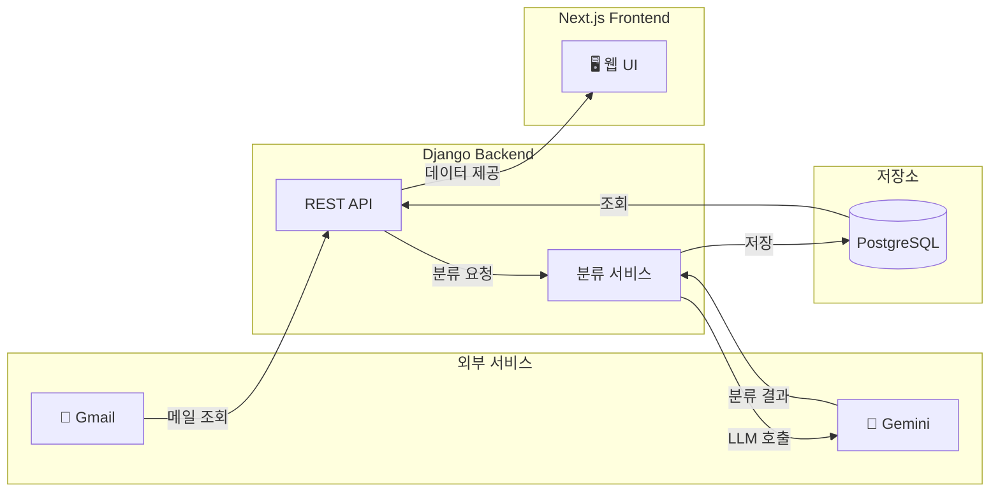

---

## 2. 전체 시스템 아키텍처

### 2.1 아키텍처 다이어그램

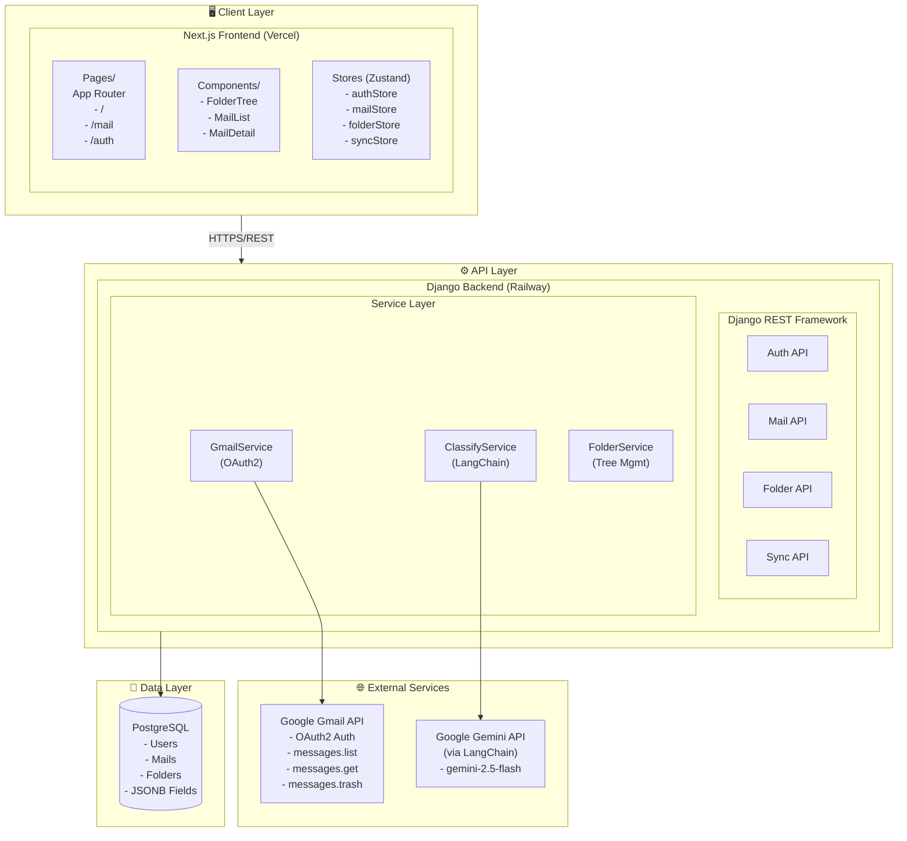

### 2.2 배포 아키텍처

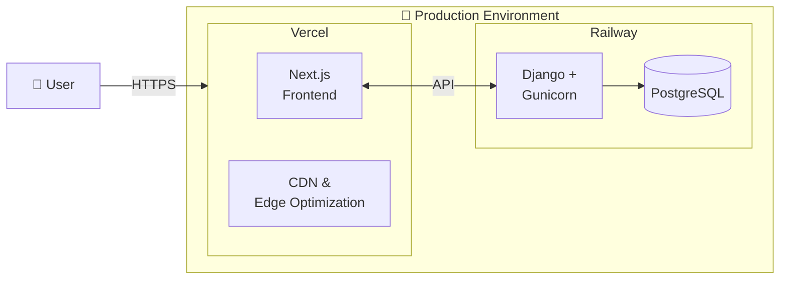

---

## 3. 기술 스택

### 3.1 기술 스택 상세

| 레이어 | 기술 | 버전 | 용도 |
|--------|------|------|------|
| **Frontend** | Next.js | 14.x | React 프레임워크 (App Router) |
| | TypeScript | 5.x | 타입 안정성 |
| | Tailwind CSS | 3.x | 스타일링 |
| | Zustand | 4.x | 상태 관리 |
| **Backend** | Django | 5.x | 웹 프레임워크 |
| | Django REST Framework | 3.x | REST API |
| | drf-spectacular | 0.27.x | API 문서화 (Swagger) |
| | LangChain | 0.2.x | LLM 추상화 |
| | google-auth | 2.x | OAuth2 인증 |
| | google-api-python-client | 2.x | Gmail API |
| **Database** | PostgreSQL | 16.x | 메인 데이터베이스 |
| **AI/LLM** | Gemini 2.5 Flash | - | 메일 분류 |
| **배포** | Vercel | - | Frontend 호스팅 |
| | Railway | - | Backend + DB 호스팅 |

### 3.2 개발 도구

| 도구 | 용도 |
|------|------|
| uv | Python 패키지 관리 (Rust 기반, 초고속) |
| pnpm | Node.js 패키지 관리 |
| ESLint + Prettier | 코드 포매팅 |
| Ruff | Python 린팅 |
| Playwright | E2E 테스트 |
| pytest | Python 단위 테스트 |

### 3.3 디자인 패턴

#### Backend (Django) 패턴

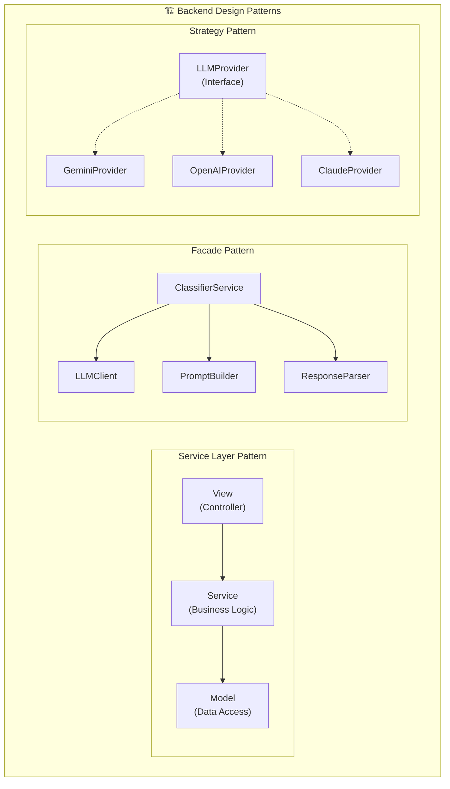

| 패턴 | 적용 위치 | 목적 |
|------|----------|------|
| **Service Layer** | `apps/*/services/` | View와 비즈니스 로직 분리, 테스트 용이성 |
| **Repository** | Django ORM | 데이터 접근 추상화 (Django 내장) |
| **Facade** | `GmailAPIClient`, `ClassifierService` | 복잡한 외부 API 단순화 |
| **Strategy** | `LLMClient` | LLM 제공자 교체 용이 (LangChain 활용) |
| **DTO** | `serializers.py` | 계층 간 데이터 전달 객체 |

**Service Layer 예시:**
```python
# views.py - 얇은 Controller
class MailViewSet(viewsets.ModelViewSet):
    def list(self, request):
        mails = self.mail_service.get_mails_by_folder(
            user=request.user,
            folder_id=request.query_params.get('folder_id')
        )
        return Response(MailSerializer(mails, many=True).data)

# services/mail_service.py - 비즈니스 로직
class MailService:
    def get_mails_by_folder(self, user: User, folder_id: str) -> QuerySet[Mail]:
        queryset = Mail.objects.filter(user=user, is_deleted=False)
        if folder_id:
            queryset = queryset.filter(folder_id=folder_id)
        return queryset.order_by('-received_at')
```

**Strategy Pattern (LLM 교체):**
```python
# LangChain을 활용한 Strategy Pattern
from langchain_google_genai import ChatGoogleGenerativeAI
from langchain_openai import ChatOpenAI

class LLMClient:
    def __init__(self, provider: str = "gemini"):
        self.llm = self._create_llm(provider)

    def _create_llm(self, provider: str):
        match provider:
            case "gemini":
                return ChatGoogleGenerativeAI(model="gemini-2.5-flash")
            case "openai":
                return ChatOpenAI(model="gpt-4o-mini")
            case _:
                raise ValueError(f"Unknown provider: {provider}")
```

#### Frontend (Next.js) 패턴

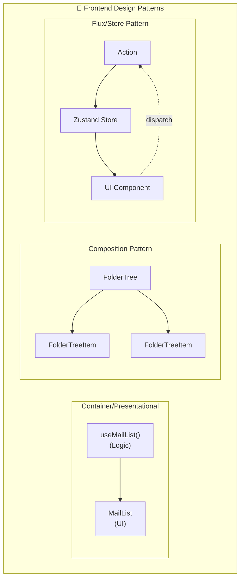

| 패턴 | 적용 위치 | 목적 |
|------|----------|------|
| **Container/Presentational** | `hooks/` + `components/` | 로직과 UI 분리 |
| **Custom Hooks** | `hooks/useMails.ts` 등 | 재사용 가능한 상태 로직 추출 |
| **Composition** | `FolderTree` → `FolderTreeItem` | 컴포넌트 조합으로 복잡한 UI 구성 |
| **Store Pattern** | Zustand stores | 전역 상태의 중앙 집중 관리 |
| **Provider Pattern** | Next.js Layout | 인증, 테마 등 컨텍스트 주입 |

**Container/Presentational 예시:**
```typescript
// hooks/useMails.ts - Container (Logic)
export function useMails(folderId?: string) {
  const { mails, isLoading, fetchMails } = useMailStore();

  useEffect(() => {
    fetchMails(folderId);
  }, [folderId]);

  return { mails, isLoading };
}

// components/mail/MailList.tsx - Presentational (UI)
'use client'

export function MailList({ folderId }: { folderId?: string }) {
  const { mails, isLoading } = useMails(folderId);

  if (isLoading) return <MailListSkeleton />;

  return (
    <ul>
      {mails.map(mail => <MailListItem key={mail.id} mail={mail} />)}
    </ul>
  );
}
```

**Composition Pattern 예시:**
```typescript
// 재귀적 트리 구조
function FolderTree({ folders }: { folders: Folder[] }) {
  return (
    <ul>
      {folders.map(folder => (
        <FolderTreeItem key={folder.id} folder={folder}>
          {folder.children && <FolderTree folders={folder.children} />}
        </FolderTreeItem>
      ))}
    </ul>
  );
}
```

---

## 4. 백엔드 아키텍처

### 4.1 Django 앱 구조

```
backend/
├── config/                    # 프로젝트 설정
│   ├── settings/
│   │   ├── base.py           # 공통 설정
│   │   ├── development.py    # 개발 환경
│   │   └── production.py     # 운영 환경
│   ├── urls.py               # 루트 URL 설정
│   └── wsgi.py
│
├── apps/
│   ├── accounts/             # 사용자 인증
│   │   ├── models.py         # User 모델
│   │   ├── views.py          # OAuth2 뷰
│   │   ├── serializers.py
│   │   ├── urls.py
│   │   └── services/
│   │       └── gmail_auth.py # Gmail OAuth2 서비스
│   │
│   ├── mails/                # 메일 관리
│   │   ├── models.py         # Mail 모델
│   │   ├── views.py          # 메일 CRUD API
│   │   ├── serializers.py
│   │   ├── urls.py
│   │   └── services/
│   │       ├── gmail_sync.py # Gmail 동기화 서비스
│   │       └── gmail_api.py  # Gmail API 클라이언트
│   │
│   ├── folders/              # 폴더 관리
│   │   ├── models.py         # Folder 모델
│   │   ├── views.py          # 폴더 CRUD API
│   │   ├── serializers.py
│   │   ├── urls.py
│   │   └── services/
│   │       └── tree_manager.py # 폴더 트리 관리
│   │
│   └── classifier/           # AI 분류
│       ├── views.py          # 분류 API
│       ├── urls.py
│       └── services/
│           ├── llm_client.py     # LangChain 클라이언트
│           ├── classifier.py     # 분류 로직
│           └── prompts.py        # 프롬프트 템플릿
│
├── core/                     # 공통 유틸리티
│   ├── exceptions.py         # 커스텀 예외
│   ├── pagination.py         # 페이지네이션
│   └── permissions.py        # 권한 클래스
│
└── manage.py
```

### 4.2 서비스 레이어 구조

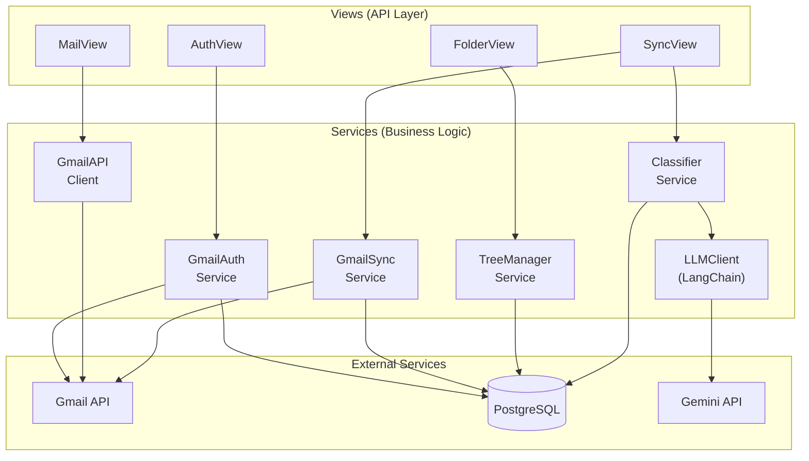

### 4.3 주요 서비스 설명

| 서비스 | 책임 |
|--------|------|
| **GmailAuthService** | OAuth2 인증 플로우, 토큰 관리, 갱신 |
| **GmailAPIClient** | Gmail API 호출 (조회, 삭제, 발송) |
| **GmailSyncService** | 초기 동기화, 증분 동기화, 배치 처리 |
| **ClassifierService** | 메일 분류 로직, 배치 분류, 재분류 |
| **LLMClient** | LangChain을 통한 Gemini API 호출 |
| **TreeManagerService** | 폴더 트리 구조 관리, 경로 파싱 |

---

## 5. 프론트엔드 아키텍처

### 5.1 디렉토리 구조

```
frontend/
├── app/                       # Next.js App Router
│   ├── layout.tsx            # 루트 레이아웃
│   ├── page.tsx              # 랜딩 페이지 (/)
│   ├── globals.css           # 전역 스타일
│   │
│   ├── (auth)/               # 인증 관련 라우트 그룹
│   │   ├── login/
│   │   │   └── page.tsx      # Gmail 연동 페이지
│   │   └── callback/
│   │       └── page.tsx      # OAuth 콜백 처리
│   │
│   └── (main)/               # 메인 앱 라우트 그룹
│       ├── layout.tsx        # 3단 레이아웃 (폴더|목록|상세)
│       ├── mail/
│       │   ├── page.tsx      # 메일 목록 (기본)
│       │   └── [id]/
│       │       └── page.tsx  # 메일 상세
│       └── unread/
│           └── page.tsx      # 읽지 않은 메일함
│
├── components/
│   ├── ui/                   # 기본 UI 컴포넌트
│   │   ├── Button.tsx
│   │   ├── Input.tsx
│   │   ├── Modal.tsx
│   │   ├── Toast.tsx
│   │   └── Skeleton.tsx
│   │
│   ├── layout/               # 레이아웃 컴포넌트
│   │   ├── Header.tsx
│   │   ├── Sidebar.tsx
│   │   └── StatusBar.tsx     # 동기화 상태바
│   │
│   ├── mail/                 # 메일 관련 컴포넌트
│   │   ├── MailList.tsx
│   │   ├── MailListItem.tsx
│   │   ├── MailDetail.tsx
│   │   └── MailActions.tsx   # 삭제, 이동 버튼
│   │
│   ├── folder/               # 폴더 관련 컴포넌트
│   │   ├── FolderTree.tsx
│   │   ├── FolderTreeItem.tsx
│   │   ├── FolderCreateModal.tsx
│   │   └── FolderMoveModal.tsx
│   │
│   └── sync/                 # 동기화 관련 컴포넌트
│       ├── SyncProgress.tsx
│       └── SyncStatus.tsx
│
├── stores/                   # Zustand 상태 관리
│   ├── authStore.ts          # 인증 상태
│   ├── mailStore.ts          # 메일 목록 상태
│   ├── folderStore.ts        # 폴더 트리 상태
│   └── syncStore.ts          # 동기화 상태
│
├── hooks/                    # 커스텀 훅
│   ├── useAuth.ts            # 인증 훅
│   ├── useMails.ts           # 메일 조회 훅
│   ├── useFolders.ts         # 폴더 조회 훅
│   ├── useSync.ts            # 동기화 훅
│   └── useNotification.ts    # Web Notification 훅
│
├── lib/                      # 유틸리티
│   ├── api.ts                # API 클라이언트 (fetch wrapper)
│   ├── constants.ts          # 상수
│   └── utils.ts              # 유틸 함수
│
├── types/                    # TypeScript 타입
│   ├── mail.ts
│   ├── folder.ts
│   ├── user.ts
│   └── api.ts
│
├── public/
│   └── images/
│
├── next.config.js
├── tailwind.config.js
├── tsconfig.json
└── package.json
```

### 5.2 컴포넌트 구조

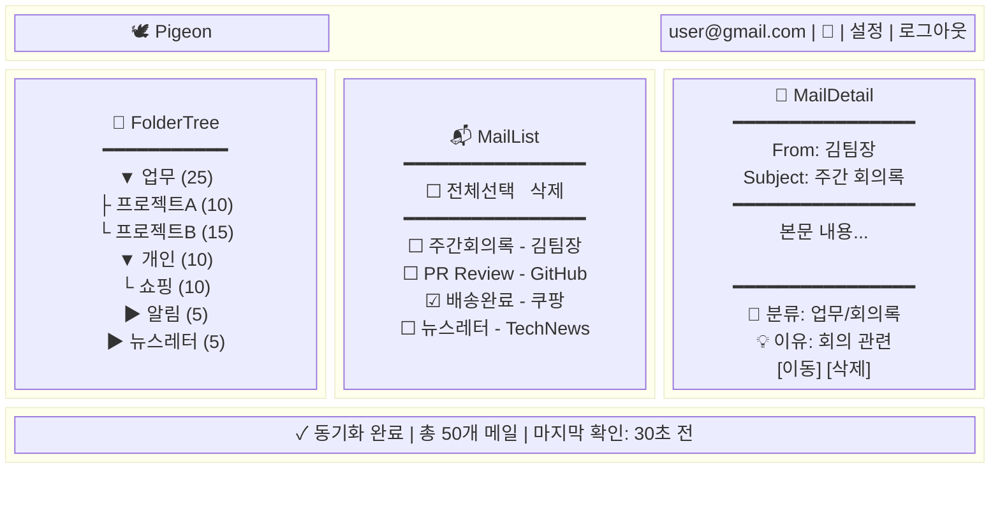

### 5.3 상태 관리 (Zustand)

```typescript
// stores/mailStore.ts
interface MailStore {
  mails: Mail[];
  selectedMailId: string | null;
  isLoading: boolean;

  // Actions
  fetchMails: (folderId?: string) => Promise<void>;
  selectMail: (id: string) => void;
  deleteMail: (id: string) => Promise<void>;
  moveMail: (id: string, folderId: string) => Promise<void>;
}

// stores/folderStore.ts
interface FolderStore {
  folders: FolderTree[];
  selectedFolderId: string | null;
  totalUnreadCount: number;

  // Actions
  fetchFolders: () => Promise<void>;
  selectFolder: (id: string) => void;
  createFolder: (name: string, parentId?: string) => Promise<void>;
}

// stores/syncStore.ts
interface SyncStore {
  status: 'idle' | 'syncing' | 'classifying' | 'completed' | 'error';
  syncProgress: number;
  classifyProgress: number;
  lastSyncAt: Date | null;

  // Actions
  startSync: () => Promise<void>;
  pollStatus: () => Promise<void>;
}
```

---

## 6. 데이터 흐름

### 6.1 OAuth2 인증 플로우

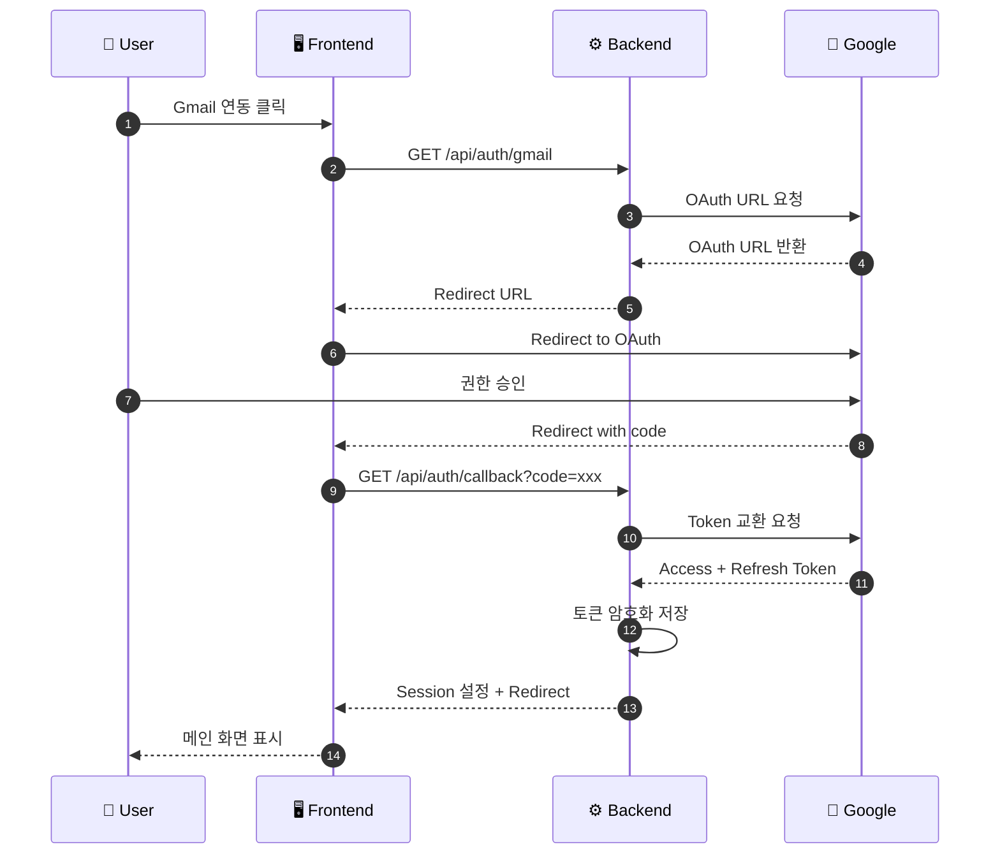

### 6.2 메일 동기화 + 분류 플로우

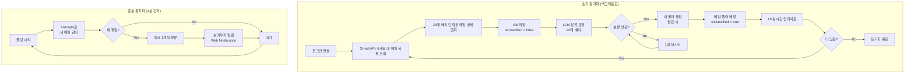

### 6.3 분류 실패 처리 플로우

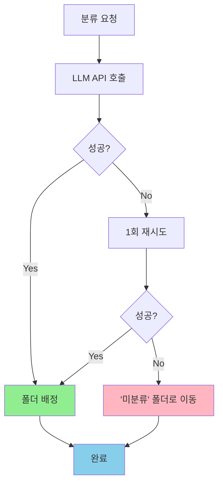

---

## 7. API 구조 개요

### 7.1 API 엔드포인트 요약

| 도메인 | 엔드포인트 | 메서드 | 설명 |
|--------|-----------|--------|------|
| **Auth** | `/api/auth/gmail` | GET | Gmail OAuth 시작 |
| | `/api/auth/gmail/callback` | GET | OAuth 콜백 |
| | `/api/auth/me` | GET | 현재 사용자 정보 |
| | `/api/auth/logout` | POST | 로그아웃 |
| **Sync** | `/api/sync/start` | POST | 동기화 시작 |
| | `/api/sync/status` | GET | 동기화 상태 조회 |
| | `/api/sync/poll` | GET | 새 메일 확인 |
| **Mails** | `/api/mails` | GET | 메일 목록 조회 |
| | `/api/mails/:id` | GET | 메일 상세 (자동 읽음 처리) |
| | `/api/mails/:id` | DELETE | 메일 삭제 |
| | `/api/mails` | DELETE | 메일 일괄 삭제 |
| | `/api/mails/:id/folder` | PATCH | 메일 폴더 이동 |
| | `/api/mails/:id/read` | PATCH | 읽음 처리 |
| **Folders** | `/api/folders` | GET | 폴더 트리 조회 |
| | `/api/folders` | POST | 폴더 생성 |

### 7.2 인증 방식

- **Session 기반 인증** (Django Session)
- Access Token은 서버에서 관리
- Refresh Token으로 자동 갱신

---

## 8. 보안 아키텍처

### 8.1 인증/인가

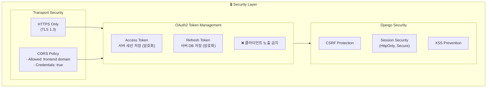

### 8.2 Rate Limiting

- Gmail API: 단순 Rate Limiting (exponential backoff)
- LLM API: 요청 간 딜레이

---

## 9. 확장성 고려사항

### 9.1 현재 MVP 제약사항

| 항목 | MVP 범위 | 확장 가능성 |
|------|---------|------------|
| 메일 제공자 | Gmail만 | Outlook, 기타 IMAP |
| 계정 수 | 단일 계정 | 다중 계정 |
| 동기화 | 받은편지함만 | 전체 라벨 |
| 분류 학습 | 없음 | 피드백 기반 학습 |
| 검색 | 없음 | 전문 검색 |

### 9.2 향후 확장 아키텍처

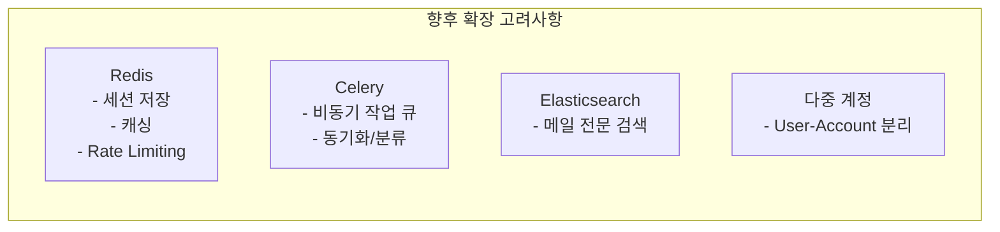

---

## 10. 모니터링 및 로깅

### 10.1 로깅 전략

| 레벨 | 용도 |
|------|------|
| ERROR | API 오류, LLM 오류, Gmail API 오류 |
| WARNING | Rate Limit 경고, 재시도 발생 |
| INFO | 동기화 시작/완료, 분류 완료 |
| DEBUG | API 요청/응답, 개발 디버깅 |

### 10.2 핵심 메트릭

- 동기화 성공/실패율
- 분류 정확도 (사용자 피드백 기반)
- API 응답 시간
- Gmail API 할당량 사용률

---

## 부록

### A. 환경 변수

```bash
# Backend (.env)
DEBUG=False
SECRET_KEY=your-secret-key
DATABASE_URL=postgres://...

# Gmail OAuth
GOOGLE_CLIENT_ID=xxx
GOOGLE_CLIENT_SECRET=xxx
GOOGLE_REDIRECT_URI=https://api.pigeon.app/api/auth/gmail/callback

# LLM
GOOGLE_API_KEY=xxx  # Gemini API

# Frontend
NEXT_PUBLIC_API_URL=https://api.pigeon.app

# Frontend (.env.local)
NEXT_PUBLIC_API_URL=https://api.pigeon.app
```

### B. 관련 문서

- [제품 기획서](./PRODUCT_SPEC.md)
- [기술 결정 기록](./DECISIONS.md)
- [컨벤션 가이드](./CONVENTIONS.md)
- [API 명세서](./API_SPEC.md) (작성 예정)
- [데이터베이스 설계](./DATABASE.md) (작성 예정)

---

*이 문서는 프로젝트 진행에 따라 지속적으로 업데이트됩니다.*
